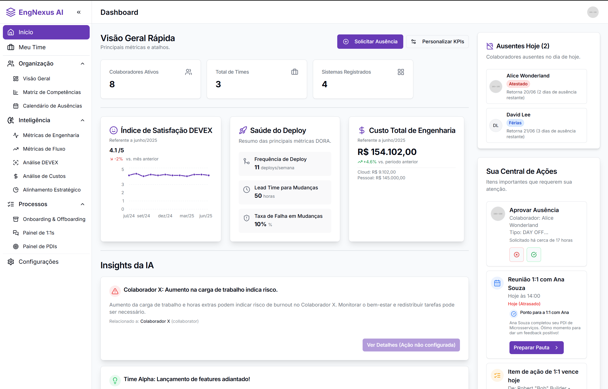

# EngNexus AI - Seu Copiloto de IA para Liderança em Engenharia

[](https://engnexusia.com)

EngNexus AI é uma plataforma inovadora projetada para ser o copiloto de IA para líderes de engenharia. Nossa missão é conectar os pontos entre pessoas, código, fluxo de trabalho e custos, permitindo que líderes de tecnologia parem de gerenciar planilhas e comecem a liderar com clareza estratégica e insights proativos.

Esta landing page foi construída para apresentar o EngNexus AI, suas funcionalidades e convidar usuários para a lista de espera do lançamento beta, além de coletar sugestões.

## ✨ Funcionalidades da Landing Page

*   **Hero Section Impactante**: Apresenta a proposta de valor principal e um CTA para acesso antecipado.
*   **Visão da IA (AIVisionSection)**: Demonstra o poder da IA em gerar insights correlacionando diferentes domínios de dados.
*   **Matriz de Funcionalidades Interativa**: Permite aos usuários explorar as diversas capacidades da plataforma.
*   **FAQ (Perguntas Frequentes)**: Responde às dúvidas comuns dos visitantes.
*   **CTA Final (Formulário de Sugestões)**: Convida os usuários a enviarem feedback e sugestões.
*   **Rodapé Informativo**: Link para a página de Política de Privacidade.
*   **Página de Política de Privacidade**: Página dedicada com informações sobre o tratamento de dados.
*   **Captura de E-mail e Sugestões Funcional**: Integração direta com [Formspree](https://formspree.io/) para receber envios de formulário.
*   **Design Moderno e Responsivo**: Utiliza ShadCN UI e Tailwind CSS para uma experiência visual agradável.
*   **Otimizada para SEO**: Metadados ricos, dados estruturados (JSON-LD) e diretrizes para `robots.txt` e `sitemap.xml`.

## 🚀 Tecnologias Utilizadas

*   **Framework**: [Next.js](https://nextjs.org/) (com App Router)
*   **Linguagem**: [TypeScript](https://www.typescriptlang.org/)
*   **Estilização**: [Tailwind CSS](https://tailwindcss.com/)
*   **Componentes UI**: [ShadCN UI](https://ui.shadcn.com/)
*   **Ícones**: [Lucide React](https://lucide.dev/)
*   **Serviço de Backend de Formulário**: [Formspree](https://formspree.io/)
*   **Animações**: Animações sutis com CSS e Intersection Observer.
*   **Inteligência Artificial (Genkit)**:
    *   `@genkit-ai/next`: Integração do Genkit com Next.js.
    *   `genkit`: Core do Genkit.
    *   Exemplo de fluxo (`generateInsightCard`) para demonstrar a capacidade de geração de insights da IA.
*   **Linting & Formatting**: ESLint (configuração padrão do Next.js).

## 📋 Pré-requisitos

*   [Node.js](https://nodejs.org/) (versão 18.x ou superior recomendada)
*   [npm](https://www.npmjs.com/) ou [yarn](https://yarnpkg.com/)
*   Uma conta [Formspree](https://formspree.io/) (plano gratuito disponível) para os formulários de contato.

## ⚙️ Configuração do Ambiente

1.  **Clone o repositório:**
    ```bash
    git clone https://github.com/SEU_USUARIO/NOME_DO_REPOSITORIO.git
    cd NOME_DO_REPOSITORIO
    ```

2.  **Instale as dependências:**
    ```bash
    npm install
    # ou
    yarn install
    ```

3.  **Configure os Endpoints do Formspree:**
    *   Este projeto usa [Formspree](https://formspree.io/) para gerenciar o envio de formulários.
    *   Crie dois formulários no seu painel Formspree: um para "Acesso Antecipado" e outro para "Sugestões".
    *   Pegue os endpoints (URLs) fornecidos pelo Formspree e substitua os URLs de exemplo nos seguintes locais:
        *   `src/components/landing/HeroSection.tsx`: na prop `formSpreeEndpoint`.
        *   `src/components/landing/FinalCtaSection.tsx`: na prop `formSpreeEndpoint`.

4.  **Configure as Variáveis de Ambiente:**
    Crie um arquivo `.env.local` na raiz do projeto.
    ```env
    # URL base da sua aplicação (necessário para SEO e sitemap)
    NEXT_PUBLIC_BASE_URL="http://localhost:9002" # Para desenvolvimento local
    # NEXT_PUBLIC_BASE_URL="https://yourdomain.com" # Para produção

    # Nome da sua aplicação (usado em metadados e e-mails)
    NEXT_PUBLIC_APP_NAME="EngNexus AI"

    # Chave de API do Google AI Studio (ou outro provedor Genkit configurado)
    # GOOGLE_API_KEY="SUA_GOOGLE_AI_API_KEY"
    ```
    *   **`NEXT_PUBLIC_BASE_URL`**: Essencial para metadados de SEO e geração do sitemap.
    *   **`GOOGLE_API_KEY`**: Necessária para usar modelos do Google AI com Genkit.

## ▶️ Rodando o Projeto

1.  **Para desenvolvimento:**
    Em dois terminais separados:

    *   Terminal 1 (Next.js App):
        ```bash
        npm run dev
        ```

    *   Terminal 2 (Genkit Dev Server):
        ```bash
        npm run genkit:dev
        ```

2.  **Para build de produção:**
    ```bash
    npm run build
    ```

3.  **Para iniciar o servidor de produção (após o build):**
    ```bash
    npm run start
    ```

## 📈 Otimizações de SEO

A landing page foi desenvolvida com SEO em mente. Para completar a configuração:

**1. Crie o arquivo `public/robots.txt`:**
Este arquivo informa aos motores de busca quais páginas eles podem ou não rastrear.
```txt
# https://www.robotstxt.org/robotstxt.html
User-agent: *
Disallow:

Sitemap: https://yourdomain.com/sitemap.xml
```
**Lembre-se de substituir `https://yourdomain.com` pela URL real do seu site.**

**2. Crie o arquivo `public/sitemap.xml`:**
Este arquivo ajuda os motores de busca a descobrir e entender a estrutura do seu site.
```xml
<?xml version="1.0" encoding="UTF-8"?>
<urlset xmlns="http://www.sitemaps.org/schemas/sitemap/0.9">
  <url>
    <loc>https://yourdomain.com</loc>
    <lastmod>2024-05-29</lastmod>
    <changefreq>monthly</changefreq>
    <priority>1.0</priority>
  </url>
  <url>
    <loc>https://yourdomain.com/privacy-policy</loc>
    <lastmod>2024-05-29</lastmod>
    <changefreq>yearly</changefreq>
    <priority>0.5</priority>
  </url>
</urlset>
```
**Lembre-se de substituir `https://yourdomain.com` pela URL real do seu site e ajustar a data `lastmod` se necessário.**

**3. Crie Imagens para Redes Sociais:**
Para uma melhor aparência ao compartilhar o link, crie e adicione as seguintes imagens na pasta `public/`:
*   `og-image.png` (tamanho recomendado: 1200x630 pixels)
*   `twitter-image.png` (tamanho recomendado: 1200x600 pixels)
*   `logo.png` (tamanho recomendado: 200x60 pixels ou similar)

## 🎨 Estrutura de Pastas (Principais)

```
.
├── public/                   # Arquivos estáticos (robots.txt, sitemap.xml, imagens)
├── src/
│   ├── ai/                   # Lógica e fluxos do Genkit
│   ├── app/                  # Rotas do Next.js App Router
│   │   ├── globals.css
│   │   ├── layout.tsx
│   │   └── page.tsx
│   ├── components/
│   │   ├── landing/
│   │   └── ui/
│   ├── hooks/
│   └── lib/
├── .env.local                # Arquivo para variáveis de ambiente
├── next.config.ts
├── package.json
└── tsconfig.json
```

**Nota:** Os formulários agora enviam dados diretamente para o Formspree, então a rota de API em `src/app/api/` foi removida.

## 📄 Licença

Este projeto é de propriedade da EngNexus AI. Todos os direitos reservados.
